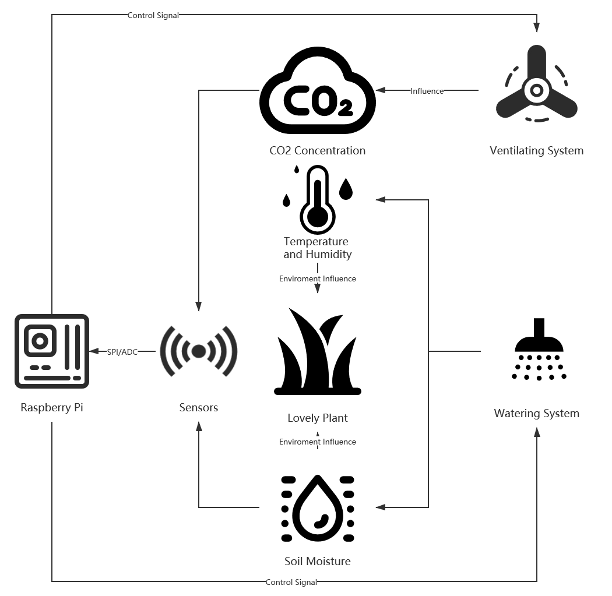

<h1 align="center">

   
  Smart Eco-Plant System
   
  
  
  
  
   
</h1> 

# Follow us
  <a href="https://www.youtube.com/channel/UCa6wbjpejbbG89zu2GJMtjQ/featured"></img></a>
  <a href="https://twitter.com/SmartEcoPlantSy"></img></a>

# Contributors
* Haitem Bahri (https://github.com/Haitem7Bahri)
* Tao Xu (https://github.com/TaoXu-Git) 
* Khanisorn Chayangsu (https://github.com/windthestorm)

# Introduction

Smart Eco-Plant system is an intelligent system to help plants grow better by monitoring the environmental parameters the affect growth and manipulate these parameters using actuators to achieve the best atmosphere for the plants to grow better. 
 
<h1 align="center">
</img>

> SmartEcoPlantSystem  

# Structure diagram

</img>
 
Brief processflow shown below: 
 
<h1 align="center">
</img>

# Wiring diagram

<h1 align="center">
</img>

## Components
Smart Eco-Plant System consists of sensor part and actual part. Multiple sensors are in charge of collecting and transmitting the environment parameters. Actuators are applied for adjusting the environment factors to make enviroment suitable for the growth of the required plant. Description for each sensor and actuators is attached. Meanwhile, some important relevant supporting components are also attached.  

### Sensors

* Temperature Sensor: `KY-013` 
[Link](https://www.amazon.com/KY-013-Analog-Temperature-Sensor-arduino/dp/B07P87M5GW)
 

* Soil Moisture Sensor: `SEN-13637` 
[Link](https://www.amazon.co.uk/gp/product/B07V6SZYZW/ref=ppx_yo_dt_b_asin_title_o06_s00?ie=UTF8&psc=1)
 

### Actuators

* Ventilating System:  
[Link](https://www.aliexpress.com/item/32855526132.html?albpd=en32855526132&acnt=494-037-6276&aff_platform=aaf&albpg=539263010115&netw=u&albcp=12555209680&pvid=0c99d98e-a417-47d7-a73f-18b41ae4b118&sk=UneMJZVf&scm=1007.23534.124000.0&trgt=539263010115&terminal_id=605da29c290e442d983f3966a9b395c6&needSmbHouyi=false&albbt=Google_7_shopping&src=google&crea=en32855526132&aff_fcid=2211ca5653d3499e80905691564f9f3f-1618792871671-04778-UneMJZVf&gclid=Cj0KCQjwse-DBhC7ARIsAI8YcWKmyHHRcOQm58pDKarFQjtV9aFBtE-vJXvx_3LW_xfRjtH_jiBkoaQaAnTYEALw_wcB&albag=122168291729&aff_fsk=UneMJZVf&albch=shopping&albagn=888888&isSmbAutoCall=false&aff_trace_key=2211ca5653d3499e80905691564f9f3f-1618792871671-04778-UneMJZVf&rmsg=do_not_replacement&device=c&gclsrc=aw.ds)

* Watering System  
[Link](https://www.amazon.co.uk/gp/product/B07M8VV4FW/ref=ppx_yo_dt_b_asin_title_o04_s00?ie=UTF8&psc=1)

### Supporting Components

* Microchip `mcp3008`

# Getting Started

1. Make a clone of the repository on your raspberry pi:

`git clone https://github.com/Haitem7Bahri/SmartEcoPlantSystem`

2. Navigate to the repository folder and create build folder:

`mkdir build`

3. Navigate to build folder:

`cd build`

4. Run Cmake from build folder:

`cmake ..`

5. Run Make:

`make`

6. Run Program:

`./SmartEcoPlantSystem`

## Software
In the project, we use SPI interface to transmit data from sensors to Raspberry Pi. However, the sensors we use are not all support SPI interface. The microchip mcp3008 is applied for unifying the interface which would significantly increasing our coding effiency. For example, the Carbondioxide Sensor uses UART. The support to UART on raspberry pi is really bad but the support to SPI is good. 

### How to use UART
It is the latest product of the JingXunChangTong whose customers are the hecienda owners. Therefore, it is relatively cheap and tough while accuracy being still acceptable.
We also provide the carbondioxide sensor's code for UART interface on Raspberry Pi 4b for those who don't want to purchase the mcp3008. 
In order to transmit the data, we must enable the UART(not the ubstable miniuart) first. 
Open the miniuart via `sudo raspi-config` then `reboot`  
Change the default UART serial port via add `dtoverlay=pi3-disable-bt ` to `sudo vi /boot/config.txt`  
Then check `ls -l /dev/seri*`  
The bluetooth would be closed if we enable the UART, so think twice.  

### How to use mcp3008
</img>  
MCP3008 is a ADC chip which can make SPI interface on RaspberryPi more convenient. The library writen in cpp can be found in https://github.com/halherta/RaspberryPi-mcp3008Spi.
